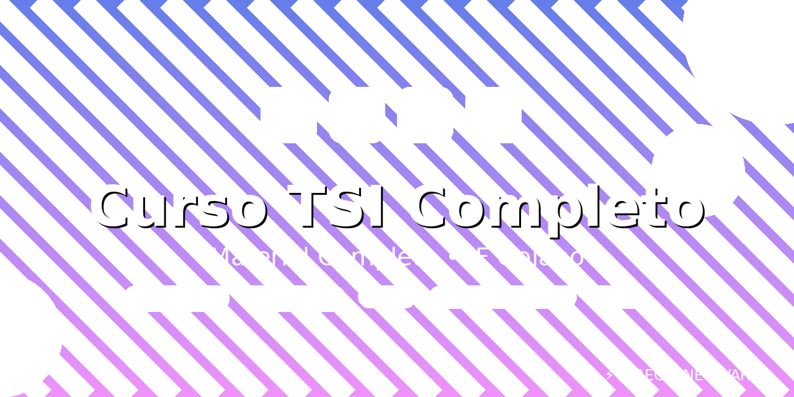

# Curso TSI Completo

<div align="center">


<!-- Adicione sua imagem de capa aqui -->


</div>

## 📚 Sobre o Projeto

Material completo do curso de TSI - IF Goiano

## 🎯 Conteúdo

- 📖 Materiais de estudo
- 💻 Códigos e exemplos práticos
- 📝 Anotações e resumos
- 🎓 Projetos desenvolvidos

## 🛠️ Tecnologias

- TypeScript
- JavaScript
- HTML/CSS
- E outras tecnologias abordadas no curso

## 📂 Estrutura do Repositório

```
Curso-TSI-Completo/
│
├── materiais/          # Materiais teóricos
├── projetos/           # Projetos práticos
├── exercicios/         # Exercícios resolvidos
└── README.md           # Este arquivo
```

## 🚀 Como Usar

1. Clone este repositório
```bash
git clone https://github.com/REGYANETAVARES/Curso-TSI-Completo.git
```

2. Navegue até a pasta desejada
```bash
cd Curso-TSI-Completo
```

## 🤝 Como Compartilhar

- 📌 **Link direto**: `https://github.com/REGYANETAVARES/Curso-TSI-Completo`
- 📱 **No LinkedIn**: Compartilhe diretamente o link
- 📧 **No currículo**: Adicione na seção de projetos
- 👥 **Com colegas de classe**: Envie o link diretamente

## 👨‍💻 Autor

**Regyane Tavares**

- GitHub: [@REGYANETAVARES](https://github.com/REGYANETAVARES)

## 📝 Licença

Este projeto está sob a licença MIT.

---

⭐ Se este repositório te ajudou, considere dar uma estrela!
